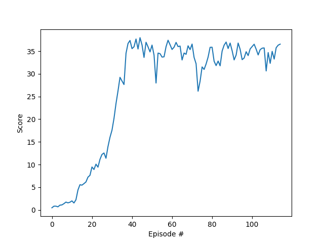

# Continuous control using DDPG
## Project environment
This project utilizes DDPG algorithm to train an agent robot arm to reach a moving target by controlling the torque in its joints.

### State space
- Dimension: 33
- Dimensions of the state space consists of the position, rotation, velocity, and angular velocities of the arm and the location of the target.

### Action space
- Dimensions: 4
- The action space is a vector of four numbers corresponding to the torque of the two joints. The value of each dimension can take on values between [-1,1]
  
### Rewards
- A reward of +0.1 is given each time step that the arm can position itself in the target location.

### Criteria for a solved environment
The agent must receive an average score greater than 30, averaged over consecutive 100 episodes.
In the case of multiple agents interacting with the environment at once, the average of the score over all the agents must satisfy above requirement.

## Getting started

### Instructions for installing dependencies and downloading needed files

### How to run the code
- Run the Continuous_Control.py to train the model.
- Set the appropriate address to the Unity environment file corresponding to the correct operating system in the code below.
   env = UnityEnvironment(file_name='Reacher_Windows_x86_64_multiple/Reacher.exe')
- Set load_model_continue_learning = True to load a pre-trained model and continue training.

# Report

## Learning algorithm
- The DDPG algorithm was implemented in this project.
- Actor and critic target network were updated using soft update with the input tau value.
- Ornstein-Uhlenbeck process noise was added to action output with theta = 0.15 and sigma = 0.2
- Adam optimizer was used for both actor and critic network with hyperparameters below.
  
### Hyperparameters
- Replay buffer size = int(1e5) 
- Experience replay minibatch siz = 128 
- Discount factor gamme = 0.99
- Soft update rate tau = 1e-3   
- Actor learning rate = 1e-4    
- Critic learning rate = 1e-3     
- OU noise theta = 0.15
- OU noise sigma = 0.2
  
### Model architecture

#### Actor
- Layer 1: Linear fully connected (state_size -> 256) : ReLU activation
- Layer 2: Linear fully connected (256 -> action_size) : tanh activation

#### Critic
- Layer 1: Linear fully connected (state_size -> 256) : Leaky ReLU activation
- Layer 2: Linear fully connected (256+action_size -> 256) : Leaky ReLU activation
- Layer 3: Linear fully connected (256 -> 128) : Leak ReLU activation
- Layer 4: Linear fully connected (128 -> 1) : no activation
  
## Result and plot of rewards
Environment solved in 15 episodes.

## Ideas for future work
- Implement other policy based methods such as PPO and compare performance.
- Adjust OU noise parameters to investigate its effect.
