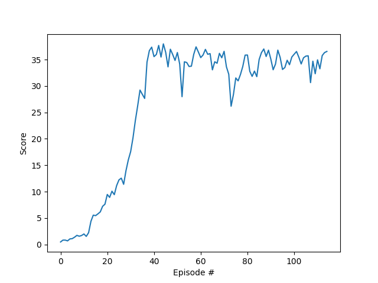

# Report

## Learning algorithm
- The DDPG algorithm was implemented in this project.
- Actor and critic target network were updated using soft update with the tau value of 1e-3.
- Ornstein-Uhlenbeck process noise was added to action output with theta = 0.15 and sigma = 0.2
- Adam optimizer was used for both actor and critic network with learning rates below.
  
### Hyperparameters
- Replay buffer size = 1e5
- Experience replay minibatch siz = 128 
- Discount factor gamme = 0.99
- Soft update rate tau = 1e-3   
- Actor learning rate = 1e-4    
- Critic learning rate = 1e-3     
- OU noise theta = 0.15
- OU noise sigma = 0.2
  
### Model architecture

#### Actor network
- Layer 1: Linear fully connected (state_size -> 256) : ReLU activation
- Layer 2: Linear fully connected (256 -> action_size) : tanh activation

#### Critic network
- Layer 1: Linear fully connected (state_size -> 256) : Leaky ReLU activation
- Layer 2: Linear fully connected (256+action_size -> 256) : Leaky ReLU activation
- Layer 3: Linear fully connected (256 -> 128) : Leak ReLU activation
- Layer 4: Linear fully connected (128 -> 1) : no activation
  
## Result and plot of rewards
Environment solved in 15 episodes.

## Ideas for future work
- Implement other policy based methods such as PPO and compare performance.
- Adjust OU noise parameters to investigate its effect.
